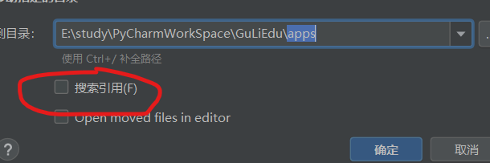
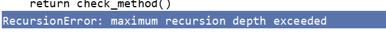
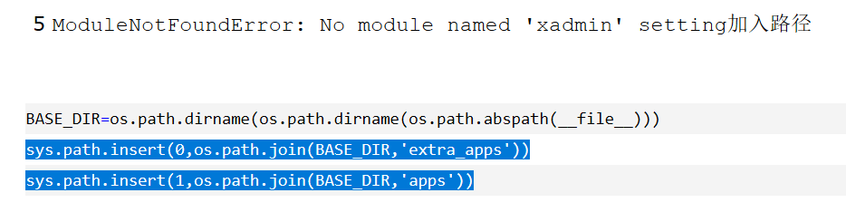
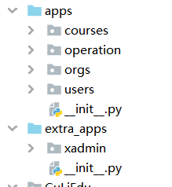
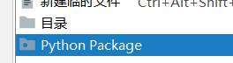
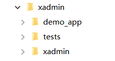

# 2.15
    
    1.python3.5 manage.py startapp operation
        只要新建一个app 就要在setting里注册
    2.管理app: 
        1. 移动 
        2. 标记源根
        3. 加入环境变量  
    

    3.sys.path.insert(0,os.path.join(BASE_DIR,'apps'))
        sys.path 代表环境变量 
        os 的理解
    
## 问题:
1.

    RecursionError: maximum recursion depth exceeded
    路由继承循环递归

## 2.16

1. 理解:
    1.  sys.path.insert(0,os.path.join(BASE_DIR,'apps'))
        1.   sys.path 代表环境变量 
        1.   os 的理解
2.  Python3.5 和 pip3.5 的理解:
    1.  虚拟环境
    2.  packges
    3.
***     ***     ***     ***     ***
## Python Django  和 Go Web基础的 区别

***     ***     ***     ***     ***
## 总结 (快捷键&Terminal)
|  Terminal                            | 快捷键                           | 
|  ----                           | ----                               |
| 单元格 1                        | 单元格  2                          |
| 单元格 1                       |单元格   2                           |

## 问题
1.

2.pip 和 pip3.6

3.

    注意：两种不同的目录 

    
    不同的xadmin : 要与空心圆的!!!

# 2.18
1.  超级管理员 ： root ,root@qq.com,qq123123
2.  adminx.py是什么 & 原理:
    替换内置的url(r'^admin/', admin.site.urls),
3.  改名 : apps 
## 后台管理xadmin 安装流程 及 原理
***     ***     ***     ***     ***
1.  环境： Django 1.11 、xadmin github 、改 2.1
2.  配置
    2.1 extra_apps 源文件
    2.2 xadmin下的 xadmin ()空心圆
3. .py:
    1.  setting :添加搜索路径  、添加apps
    2.  urls:    url(r'^xadmin/', xadmin.site.urls),
4.  pip  install  -r  requirements.txt   -i  https://pypi.douban.com/simple/
## 问题